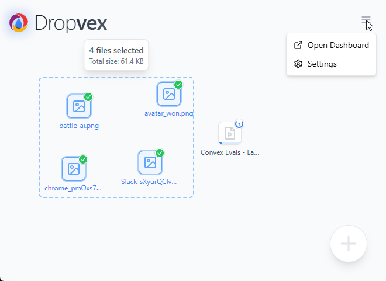
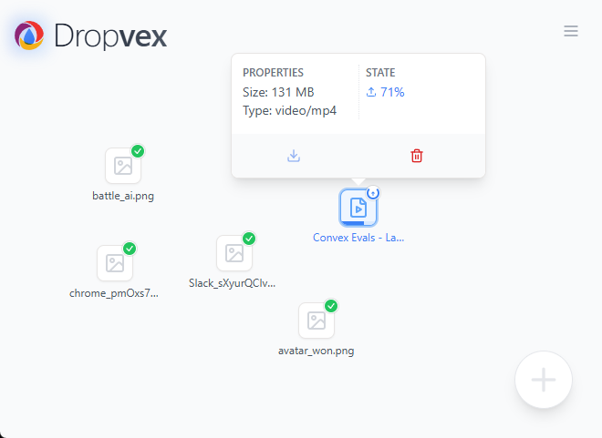
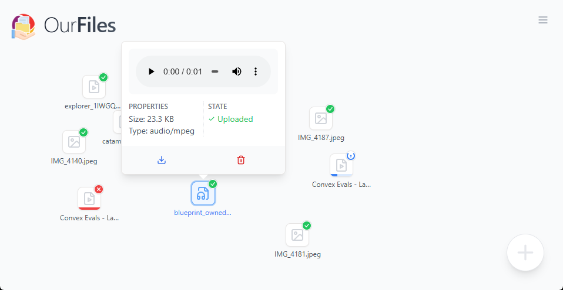

# OurFiles

A simple private file storage system powered by Convex.

Simply drag and drop files onto the inteface to add files, then drag them out to download them.

The project is built using React, Vite, Typescript, Convex, Tailwind

# Installation

This project is designed to work with [Convex self-hosted](https://github.com/get-convex/convex-backend/blob/main/self-hosted/README.md).

First install dependencies

```bash
bun install
```

then setup the env

```bash
cp .env.local.example .env.local
```

then startup the backend

```bash
cd docker
docker compose up
```

then in another window get an admin key

```bash
docker exec ourfiles-backend ./generate_admin_key.sh
```

Take that key, should look something like: `convex-self-hosted|015735929b52dacf834f1cc04bcc014f8112271becec91b608fa5efa088dd07ef2d56532a452764d1ea58c4282d99ec975` and put it in `.env.local` in `CONVEX_SELF_HOST_ADMIN_KEY`

then

```base
bun dev:self-host
```

It should now have opened a browser window for you to use.
